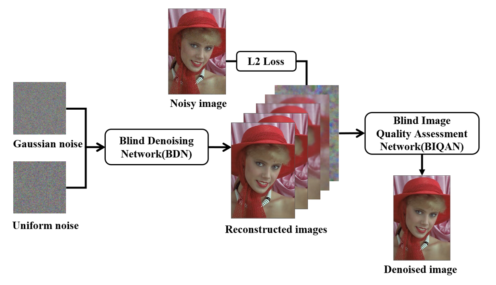
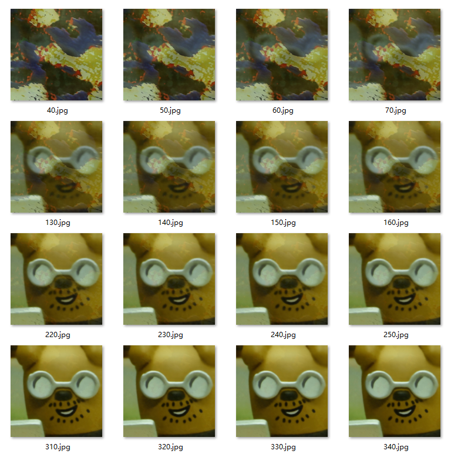
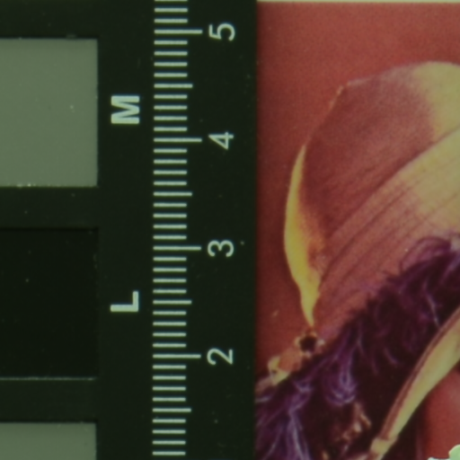
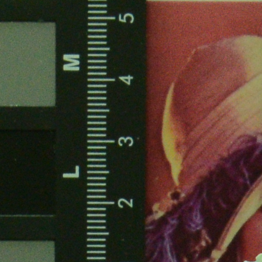
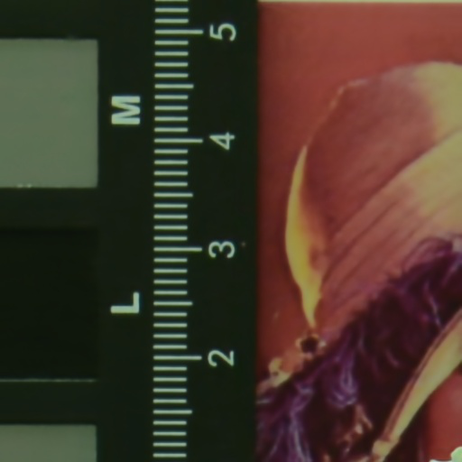

# A CNN-Based Blind Denoising Method

Official implementation of the BioCAS 2019 paper: [A CNN-Based Blind Denoising Method for Endoscopic Images](https://ieeexplore.ieee.org/document/8918994)

Pytorch implementation of blind denoising network and keras implementation of  blind image quality assessment network.

For blind denoising, we optimize the [Deep Image Prior](http://openaccess.thecvf.com/content_cvpr_2018/html/Ulyanov_Deep_Image_Prior_CVPR_2018_paper.html) method by transfer learning to reduce the number of iteration. 

To determine the quality of reconstructed image, the blind image assessment network based on [MobileNet](https://arxiv.org/abs/1704.04861) is presented to estimate the scores of image quality. 


## Architecture



## Dependencies

* torch (1.0.1.post2)
* tensorflow (1.12.0)
* keras (2.1.6)
* numpy
* matplotlib
* skimage
* opencv-python
* pandas

Run on ubuntu 16.04, python3.5, CUDA 9.0, cuDNN 7.5 with 8 Nvidia TITAN Xp  GPUs.


## Usage

### Train blind denoising network(BDN) to reconstruct noisy image

##### Step1. Reconstruct PolyU dataset

> python run_BDN.py   --dataset_real_path dataset/CC/real/ \
>
> ​         							 --dataset_mean_path dataset/CC/mean/ \
>
> ​         							 --output_path dataset/CC/20200111 \
>
> ​          							--num_iter 3500 --save_iter 20 --lr 1e-2 --gpu_id 1


##### Step2. Reconstruct CC dataset

> python run_BDN.py   --dataset_real_path dataset/PolyU/real/ \
>
> ​          							--dataset_mean_path dataset/PolyU/mean/ \
>
> ​          							--output_path dataset/PolyU/20200111 \
>
> ​          							--num_iter 5000 --save_iter 20 --lr 1e-2 --gpu_id 2


##### Tips

[PolyU dataset](https://github.com/csjunxu/PolyU-Real-World-Noisy-Images-Dataset) has 100 pairs of noisy and clean images and [CC dataset](https://github.com/woozzu/ccnoise) has 15 pairs of noisy and clean images.

Use the method of deep image prior to reconstruct one image will cost about 15 minutes with 3000 iteration. 

So you can simply download the reconstructed images from [here](https://cloud.tsinghua.edu.cn/f/7f514df294894194a2b6/?dl=1) or [here](https://pan.baidu.com/s/18Gj-mHPulmVI4__a35m2_w) and then update the dataset.


### Train blind image quality assessment network(BIQAN)

##### Setp1. Convert the PSNR of reconstructed images to AVA dataset format

> python generator_dataset.py  --dataset_path dataset/PolyU_Mulit_UN_GN \
>
> ​               										--output_path dataset/PolyU_Mulit_UN_GN_PNSR.txt


##### Step2. Train the blind image quality assessment network

> python train_BIQAN.py   --dataset_image_path dataset/PolyU_Mulit_UN_GN \
>
> ​            								--dataset_file_path dataset/PolyU_Mulit_UN_GN_PNSR.txt \
>
> ​            								--output_checkpoint checkpoint/PolyU_Mulit_UN_GN/mobilenet \
>
> ​            								--output_path result/PolyU_Mulit_UN_GN \
>
> ​            								--epochs 40 --lr 1e-3 --gpu_id 3


##### Tips

You can download the trained model from [here](https://cloud.tsinghua.edu.cn/f/9df314d8f71d4620b1f3/?dl=1) or [here](https://pan.baidu.com/s/1S8gzKCiDBE8VbNhTRSZngA)


##### Step3. Test the blind image quality assessment network

> python test_BIQAN.py --dataset_image_path dataset/CC_Resume_All32 \
>
> ​            							--pre_trained_model checkpoint/PolyU_Mulit_UN_GN/mobilenet/weights.004-0.046.hdf5 \
>
> ​           							 --output_path result/CC_Resume_All32 \
>
> ​           							 --start_index 90 --gpu_id 4


## Results

#### Some reconstructed images




#### Mobilenet training loss


#### Denoised effect

|             clean image              |             noisy image              |                        denoised image                        |
| :----------------------------------: | :----------------------------------: | :----------------------------------------------------------: |
|  |  |  |


#### Comparison of CNN based algorithms

|      Method      |             Input              |             Label              |       Output        |        Back-Bone        |
| :--------------: | :----------------------------: | :----------------------------: | :-----------------: | :---------------------: |
|       MLP        |  Clean image + Gaussian noise  |          Clean image           |   Denoised image    | Fully connected network |
|      DnCNN       |  Clean image + Gaussian noise  |         Gaussian noise         |   Estimated noise   |   [Conv + BN + RELU]    |
|   Noise2Noise    | Clean image + Gaussian noise_A | Clean image + Gaussian noise_B |   Denoised image    |  Encoder-Decoder/U-net  |
| Deep image Prior | Gaussian noise + Uniform noise |          Noisy Image           | Reconstructed image |  Encoder-Decoder/U-net  |


#### Quantitative results using PSNR on the CC dataset

| Camera                | CBM3D | NC        | NI        | CC        | Proposed  |
| :-------------------- | ----- | --------- | --------- | --------- | --------- |
| Canon 5D ISO = 3200   | 37.79 | 37.72     | 38.75     | 38.37     | **40.83** |
|                       | 34.34 | 35.26     | 35.57     | 35.37     | **36.65** |
|                       | 34.27 | 34.89     | 35.55     | 34.91     | **36.30** |
| Nikon D600 ISO = 3200 | 33.70 | 34.70     | 35.59     | 34.98     | **34.97** |
|                       | 34.33 | 34.32     | **36.78** | 35.95     | 35.88     |
|                       | 35.75 | 38.57     | 39.30     | 40.51     | **41.19** |
| Nikon D800 ISO= 1600  | 36.15 | 38.18     | 38.02     | 37.99     | **38.39** |
|                       | 36.57 | 38.84     | 38.99     | 40.36     | **41.94** |
|                       | 35.47 | **38.44** | 38.19     | 38.30     | 37.99     |
| Nikon D800 ISO = 3200 | 34.00 | 38.22     | 38.05     | 39.01     | **39.76** |
|                       | 33.43 | 35.72     | 35.71     | **36.75** | 35.59     |
|                       | 33.53 | 38.58     | 32.91     | 39.06     | **41.22** |
| Nikon D800 ISO = 6400 | 29.97 | 33.61     | 33.51     | 34.61     | **34.94** |
|                       | 30.33 | 32.57     | 32.75     | 33.21     | **33.38** |
|                       | 30.21 | 32.86     | 32.88     | **33.22** | 33.02     |
| Average               | 33.99 | 36.17     | 35.33     | 36.88     | **37.47** |


## Reference

Part of code refers from [deep image prior](https://github.com/DmitryUlyanov/deep-image-prior) and [neural-image-assessment](https://github.com/titu1994/neural-image-assessment).


## Citation

If you find this project useful, we would be grateful if you cite the paper:

```
@article{BlindDenoising2019,
author = {Shaofeng Zou, Mingzhu Long, Xuyang Wang, Xiang Xie, Guolin Li, Zhihua Wang},
conference = {BioCAS 2019},
title = {A CNN-Based Blind Denoising Method for Endoscopic Images},
url = {https://ieeexplore.ieee.org/abstract/document/8918994/},
year = {2019}
}
```

## License

- For academic and non-commercial use only.
- For commercial use, please contact zousf19@mails.tsinghua.edu.cn